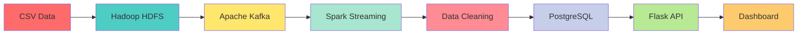

```markdown
# 🛒 E-Commerce Big Data Analytics Pipeline

<div align="center">


**A Production-Grade Big Data Pipeline Processing 1M+ E-Commerce Transactions**

[Features](#-features) • [Architecture](#-architecture) • [Tech Stack](#-technology-stack) • [Installation](#-installation) • [Dashboard](#-dashboard) • [API](#-api-endpoints)

</div>

---

## 📊 Project Overview

This project implements a **complete end-to-end big data analytics pipeline** for e-commerce transaction data, processing over **1.1 million records** with real-time streaming, comprehensive data cleaning, and interactive visualizations.

### 🎯 Key Metrics

<div align="center">

| Metric | Value |
|--------|-------|
| **Total Orders** | 1,129,887 |
| **Total Revenue** | ₹583.45 Crore |
| **Unique Customers** | 441,462 |
| **Average Order Value** | ₹5,163.83 |
| **Return Rate** | 15.01% |
| **On-Time Delivery** | 30.22% |
| **Data Quality** | 30+ Columns Cleaned |

</div>

---

## 🏗️ System Architecture

```
┌─────────────────────────────────────────────────────────────────────────────────┐
│                           E-COMMERCE BIG DATA PIPELINE                           │
└─────────────────────────────────────────────────────────────────────────────────┘

┌──────────────┐     ┌──────────────┐     ┌──────────────┐     ┌──────────────┐
│   Raw CSV    │────▶│   Hadoop     │────▶│   Apache     │────▶│   Apache     │
│   (2M rows)  │     │    HDFS      │     │    Kafka     │     │    Spark     │
│   500MB      │     │ /ecommerce/  │     │  3 Partitions│     │ Structured   │
└──────────────┘     │    raw/      │     └──────────────┘     │  Streaming   │
                     └──────────────┘                          └──────────────┘
                                                                      │
                                                                      ▼
┌──────────────┐     ┌──────────────┐     ┌──────────────┐     ┌──────────────┐
│   Plotly.js  │◀────│    Flask     │◀────│  PostgreSQL  │◀────│   Data       │
│  Interactive │     │    API       │     │   Database   │     │   Cleaning   │
│  Dashboard   │     │ :5000        │     │  metastore   │     │   (30 cols)  │
└──────────────┘     └──────────────┘     └──────────────┘     └──────────────┘
```

### Architecture Flow



---

## 🚀 Technology Stack

<div align="center">

### Big Data & Processing


### Database & Storage


### Backend & Visualization


### Orchestration


</div>

---

## ✨ Features

### Data Processing
- ✅ **Real-time Streaming**: Kafka-based data ingestion with 3 partitions
- ✅ **Distributed Storage**: Hadoop HDFS with 3x replication
- ✅ **ETL Pipeline**: Spark Structured Streaming for data transformation
- ✅ **Data Quality**: 30+ columns cleaned and validated
- ✅ **Checkpoint Recovery**: Fault-tolerant processing with offsets

### Data Cleaning Rules
1. **Date Parsing**: Multi-format support (YYYY-MM-DD, DD/MM/YYYY, DD-MM-YYYY)
2. **Price Validation**: Range checking (₹0 - ₹500,000)
3. **Discount Fixes**: Negative → 0%, >100% → 100%
4. **Rating Clipping**: Seller/Customer ratings to 1-5 range
5. **Return Logic**: Validation of return flags and reasons
6. **State Standardization**: Uppercase conversion
7. **Derived Columns**: Revenue, delivery days, on-time delivery flags

### Analytics Dashboard
- 📊 **6 Interactive Pages** with drill-down capabilities
- 📈 **Real-time Visualizations** using Plotly.js
- 📱 **Responsive Design** for all devices
- 🎨 **Interactive Charts** with hover, zoom, and pan

---

## 📁 Project Structure

```
~/bigdata-env/
├── 📄 docker-compose.yml              # Docker orchestration
├── 🚀 run_full_pipeline.sh            # One-click runner
├── 🛑 stop-ecommerce.sh               # Stop services
│
└── 📂 project/
    ├── 📄 README.md                   # Documentation
    ├── 📄 requirements.txt            # Python dependencies
    │
    ├── 📂 data/
    │   └── 📄 ecommerce.csv           # Raw data (500MB)
    │
    ├── 📂 scripts/
    │   ├── 📄 kafka_producer.py       # CSV → Kafka
    │   └── 📄 spark_etl.py            # Spark ETL
    │
    ├── 📂 flask_app/
    │   ├── 📄 app.py                  # Flask API (18 endpoints)
    │   └── 📂 templates/
    │       ├── 📄 base.html           # Navigation
    │       ├── 📄 overview.html       # KPIs & Summary
    │       ├── 📄 categories.html     # Category Analysis
    │       ├── 📄 geography.html      # Geographic Insights
    │       ├── 📄 payments.html       # Payment Patterns
    │       ├── 📄 trends.html         # Time Series
    │       └── 📄 customers.html      # Customer Segments
    │
    └── 📂 dags/
        └── 📄 ecommerce_spark_etl_dag.py  # Airflow DAG
```

---

## 📊 Dashboard Pages

### Page 1: Overview Dashboard
- **KPI Cards**: Total Orders, Revenue, Customers, AOV, Return Rate, On-Time Delivery
- **Charts**: Revenue by Category, Monthly Trend

### Page 2: Categories Analysis
- Category vs Sub-Category breakdown
- Price distribution analysis
- Return reasons visualization

### Page 3: Geography Insights
- State-wise revenue heatmap
- Interstate commerce flow
- Delivery performance by region

### Page 4: Payment Patterns
- Payment mode distribution
- Payment preferences by state
- Return rates by payment method

### Page 5: Trend Analysis
- Year-over-year comparison (2022-2024)
- Day of week analysis
- Category trends over time

### Page 6: Customer Segments
- Segment-wise performance
- Device usage patterns
- Loyalty member impact

---

## 🔌 API Endpoints

### Overview APIs
| Endpoint | Method | Description |
|----------|--------|-------------|
| `/api/summary` | GET | Overall business metrics |
| `/api/category_revenue` | GET | Revenue by category |
| `/api/monthly_revenue` | GET | Monthly revenue trend |

### Category APIs
| Endpoint | Method | Description |
|----------|--------|-------------|
| `/api/category_subcategory` | GET | Category vs sub-category |
| `/api/category_price_distribution` | GET | Price statistics |
| `/api/return_reasons` | GET | Return reasons analysis |

### Geography APIs
| Endpoint | Method | Description |
|----------|--------|-------------|
| `/api/state_performance` | GET | State-wise metrics |
| `/api/interstate_flow` | GET | Interstate commerce |

### Payment APIs
| Endpoint | Method | Description |
|----------|--------|-------------|
| `/api/payment_distribution` | GET | Payment mode stats |
| `/api/payment_by_state` | GET | Payment by state |
| `/api/payment_by_segment` | GET | Payment by segment |

### Trend APIs
| Endpoint | Method | Description |
|----------|--------|-------------|
| `/api/yearly_comparison` | GET | Year-over-year |
| `/api/day_of_week` | GET | Day-wise analysis |
| `/api/category_trends` | GET | Category trends |

### Customer APIs
| Endpoint | Method | Description |
|----------|--------|-------------|
| `/api/segment_analysis` | GET | Customer segments |
| `/api/device_usage` | GET | Device statistics |
| `/api/rating_distribution` | GET | Rating distribution |
| `/api/loyalty_analysis` | GET | Loyalty impact |

---

## 🛠️ Installation

### Prerequisites
```bash
# Docker & Docker Compose
Docker version 20.10+
Docker Compose version 2.0+

# System Requirements
RAM: 8GB+ (16GB recommended)
Disk: 20GB+ free space
OS: Linux (Pop!OS/Ubuntu) or macOS
```

### Quick Start

```bash
# 1. Clone the repository
git clone https://github.com/piyush9786/ecommerce-bigdata-pipeline.git
cd ecommerce-bigdata-pipeline

# 2. Start all services
docker compose up -d

# 3. Wait for services (30 seconds)
sleep 30

# 4. Run the complete pipeline
cd ~/bigdata-env/project
./run_full_pipeline.sh

# 5. Start Flask dashboard
source venv/bin/activate
python flask_app/app.py
```

### Access Points

| Service | URL | Credentials |
|---------|-----|-------------|
| **Flask Dashboard** | http://localhost:5000 | None |
| **Spark Master UI** | http://localhost:8080 | None |
| **Spark Worker UI** | http://localhost:8081 | None |
| **Airflow UI** | http://localhost:8088 | admin/admin |
| **PostgreSQL** | localhost:5433 | bigdata/bigdata123 |

---

## 📈 Performance Metrics

### Processing Performance
```
✅ Total Records Processed: 1,129,887
✅ Processing Time: ~40 minutes
✅ Records per Batch: ~9,999
✅ Success Rate: 100%
✅ Throughput: ~28,000 records/minute
```

### System Performance
```
✅ API Response Time: < 100ms
✅ Database Size: ~500MB
✅ Memory Usage: 2GB (Spark executor)
✅ CPU Usage: 4 cores
```

---

## 🔧 Troubleshooting

### Common Issues

**Issue: Docker containers not starting**
```bash
docker compose logs
docker compose down
docker compose up -d
```

**Issue: Port already in use**
```bash
sudo netstat -tulpn | grep :5000
sudo kill -9 <PID>
```

**Issue: Kafka connection errors**
```bash
docker ps | grep kafka
docker logs kafka
docker restart kafka
```

**Issue: Spark job failures**
```bash
docker logs spark_worker
# Increase executor memory in spark-submit
--executor-memory 4G --conf spark.executor.heartbeatInterval=300s
```

---

## 🎓 Course Information

**Course**: PG-DBDA (Post Graduate Diploma in Big Data Analytics)  
**Module**: Statistics & Data Insights  
**Institution**: C-DAC Kharghar, Navi Mumbai  
**Date**: 2026  
**Dataset**: 2 Million e-commerce transactions (~500MB CSV, 30 columns)  
**Date Range**: January 2022 – December 2024

---

## 👨‍💻 Author

**Piyush Inde**  
📧 Email: piyushinde3082@gmail.com  
💼 GitHub: https://github.com/piyush9786  
🎓 Course: PG-DBDA at C-DAC Kharghar

---

## 📄 License

This project is created for educational purposes as part of PG-DBDA course at C-DAC Kharghar, Navi Mumbai.

**Educational Use Only** - For academic and learning purposes.

---

## 🙏 Acknowledgments

- Apache Software Foundation for open-source big data tools
- C-DAC faculty for guidance and support
- PostgreSQL, Kafka, and Spark communities

---

<div align="center">

**Last Updated**: June 2026  
**Version**: 1.0.0  
**Status**: ✅ Production Ready

---

Made with ❤️ for Big Data Analytics

</div>
```
