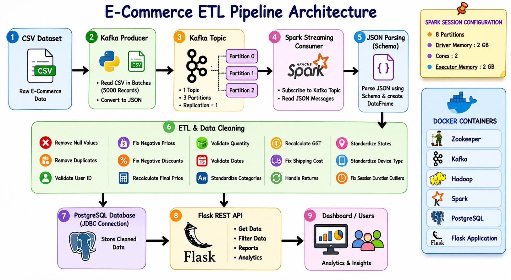

# 🚀 Big Data End-to-End E-Commerce Analytics Pipeline


> **End-to-End Real-Time E-Commerce Analytics Pipeline** using Kafka, Spark, Airflow, PostgreSQL, Docker, and Flask.

---

## 📌 Project Overview

This project implements a complete, production-grade **Big Data Analytics Pipeline** for processing and analyzing large-scale e-commerce transaction data. The system combines real-time streaming, distributed ETL processing, workflow orchestration, data warehousing, and interactive dashboard visualization using modern data engineering technologies.

The pipeline ingests raw transaction data (2 Million+ records), processes and cleans it in real-time using Apache Spark, stores it in a structured PostgreSQL database, and presents actionable business insights through a 6-page interactive Flask dashboard.

### 📊 Key Project Metrics
* **Raw Data Processed:** 2,000,000+ records (~500MB CSV)
* **Successfully Cleaned & Loaded:** 1,129,887 records
* **Total Revenue Analyzed:** ₹583.45 Crore
* **Unique Customers:** 441,462
* **Data Quality Rules Applied:** 30+ transformations

---

## 🎯 Objectives

* Build a scalable **real-time data ingestion system** using Apache Kafka.
* Process, clean, and transform streaming data using **Apache Spark Structured Streaming**.
* Automate and monitor data workflows using **Apache Airflow**.
* Store processed, analytics-ready data in **PostgreSQL**.
* Develop a RESTful API and an **interactive analytics dashboard** using Flask and Plotly.
* **Containerize** the entire big data ecosystem using Docker & Docker Compose for one-click deployment.

---

## ️ System Architecture




---

## 🛠️ Technology Stack

| Component | Technology | Purpose |
| :--- | :--- | :--- |
| **Data Ingestion** | Apache Kafka 3.6.1 | Real-time message streaming & buffering |
| **Stream Processing** | Apache Spark 3.1.1 | Distributed ETL and data cleaning |
| **Workflow Orchestration** | Apache Airflow 2.8.1 | DAG scheduling and pipeline monitoring |
| **Data Warehouse** | PostgreSQL 15 | Structured storage for cleaned data |
| **Backend API** | Flask 3.0.0 | REST API development |
| **Containerization** | Docker & Docker Compose | Service isolation and deployment |
| **Programming Language** | Python 3.11 | Application and script development |
| **Visualization** | Plotly.js | Interactive, responsive charts |

---

## 📂 Project Structure

```text
ecommerce-bigdata-pipeline/
│
├── data/
│   └── ecommerce_transactions.csv      # Raw dataset (Excluded from Git due to size)
│
├── scripts/
│   ├── kafka_producer.py               # Reads CSV and streams to Kafka
│   └── spark_etl.py                    # Spark Structured Streaming ETL logic
│
├── flask_app/
│   ├── app.py                          # Flask REST API (18 Endpoints)
│   └── templates/                      # 6-Page Interactive HTML Dashboards
│       ├── overview.html
│       ├── categories.html
│       ├── geography.html
│       ├── payments.html
│       ├── trends.html
│       └── customers.html
│
├── dags/
│   └── ecommerce_spark_etl_dag.py      # Airflow DAG for workflow orchestration
│
├── docker-compose.yml                  # Multi-container orchestration
── run_full_pipeline.sh                # One-click pipeline execution script
├── requirements.txt                    # Python dependencies
└── README.md                           # Project documentation
```

---

## ⚙️ Key Features

* **Real-time Data Streaming:** High-throughput ingestion via Kafka (3 partitions).
* **Advanced Spark ETL:** Handles 30+ complex data cleaning rules (date parsing, outlier removal, schema validation).
* **Automated Orchestration:** Airflow DAGs for scheduled and monitored pipeline execution.
* **Interactive Dashboard:** 6-page responsive UI with drill-down analytics.
* **Dockerized Deployment:** Fully containerized architecture for easy replication and deployment.
* **End-to-End Automation:** Single script (`run_full_pipeline.sh`) to spin up the entire ecosystem.

---

## 🔄 Data Processing Operations

### 1. Data Cleaning
* Remove null/invalid transaction IDs and duplicate records.
* Handle missing values and standardize categorical fields (e.g., State names, Payment modes).
* Parse multiple date formats (`YYYY-MM-DD`, `DD/MM/YYYY`, `DD-MM-YYYY`).
* Validate numerical fields (e.g., cap discounts between 0-100%, clip ratings to 1-5).

### 2. Feature Engineering
* **Time Features:** Extracted Transaction Year, Month, and Day of Week.
* **Financial Features:** Calculated `Total Revenue` (Price × Quantity) and `GST Amount`.
* **Operational Features:** Calculated `Delivery Days` and generated `Is_On_Time_Delivery` boolean flag.

---

## 📊 Dashboard Analytics

The interactive dashboard provides deep insights into:

1. **Overview:** Overall Business KPIs, Total Revenue, and Return Rates.
2. **Categories:** Revenue by Category, Sub-Category analysis, and Price distributions.
3. **Geography:** State-wise performance, interstate commerce flow, and delivery metrics.
4. **Payments:** Payment mode distribution (UPI, COD, Card) and regional preferences.
5. **Trends:** Monthly/Yearly revenue trends and seasonal seasonality.
6. **Customers:** Customer segmentation, device usage, and loyalty program impact.

---

## 🔗 API Endpoints

The Flask backend exposes the following REST API endpoints:

| Endpoint | Method | Description |
| :--- | :---: | :--- |
| `/api/summary` | GET | Overall business KPIs and metrics |
| `/api/category_revenue` | GET | Revenue breakdown by product category |
| `/api/monthly_revenue` | GET | Monthly revenue and order trends |
| `/api/state_performance` | GET | State-wise analytics and delivery metrics |
| `/api/payment_distribution` | GET | Payment mode insights and return rates |
| `/api/segment_analysis` | GET | Customer segmentation and AOV |
| `/api/device_usage` | GET | Device type analytics (Mobile/Desktop) |
| `/api/loyalty_analysis` | GET | Loyalty customer behavior and impact |

---

## 🚀 Deployment & Setup

### Prerequisites
* Docker & Docker Compose installed
* Python 3.8+ (for local virtual environment)
* Minimum 8GB RAM (16GB recommended)

### 1. Start the Infrastructure
```bash
# Clone the repository
git clone https://github.com/piyush9786/ecommerce-bigdata-pipeline.git
cd ecommerce-bigdata-pipeline

# Start all Docker containers (Hadoop, Kafka, Spark, Postgres, Airflow)
docker-compose up -d
```

### 2. Run the Complete Pipeline
```bash
# Make the script executable and run
chmod +x run_full_pipeline.sh
./run_full_pipeline.sh
```

### 3. Access the Services
| Service | URL | Credentials |
| :--- | :--- | :--- |
| **Flask Dashboard** | `http://localhost:5000` | None |
| **Spark Master UI** | `http://localhost:8080` | None |
| **Airflow Web UI** | `http://localhost:8088` | `admin` / `admin` |
| **PostgreSQL** | `localhost:5433` | `bigdata` / `bigdata123` |

---

## 📈 Workflow

1. **Load CSV Dataset:** Raw data is uploaded to Hadoop HDFS.
2. **Stream Data to Kafka:** Python producer reads from HDFS and pushes to Kafka topics.
3. **Process Data using Spark ETL:** Spark Structured Streaming consumes, cleans, and transforms data.
4. **Store Cleaned Data:** Processed records are appended to PostgreSQL.
5. **Orchestrate Tasks:** Airflow monitors and schedules the Spark jobs.
6. **Serve APIs:** Flask queries PostgreSQL to serve JSON data.
7. **Visualize Analytics:** Plotly.js renders interactive charts on the frontend.

---

## 🔥 Challenges Faced & Solutions

* **Kafka Consumer Lag & DNS Resolution:** Resolved by configuring proper Docker networking and Kafka advertised listeners for cross-container communication.
* **Spark Executor Heartbeat Timeouts:** Mitigated by tuning `spark.executor.heartbeatInterval` and `spark.network.timeout` configurations for long-running streaming jobs.
* **Schema Consistency Management:** Handled complex, messy real-world data with 30+ custom PySpark transformation rules to ensure strict schema enforcement before writing to PostgreSQL.

---


